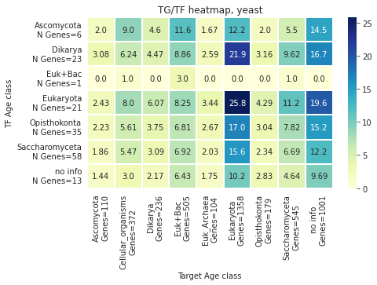
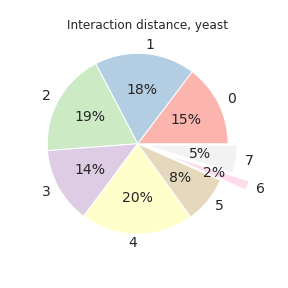
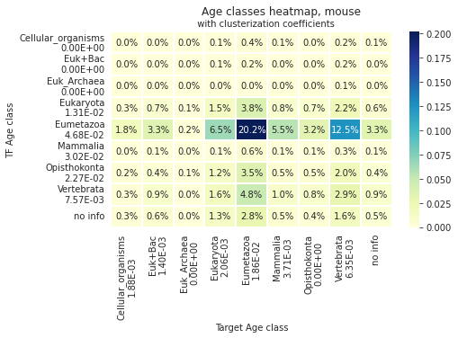
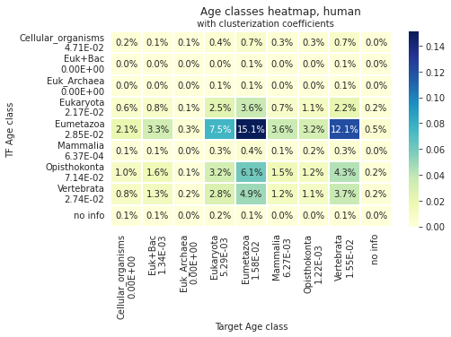
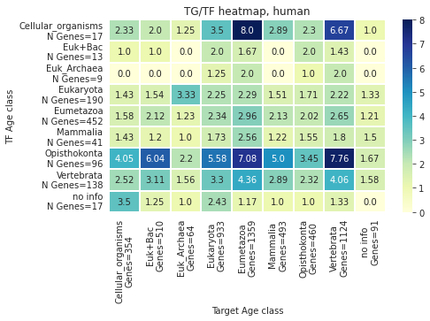

# Age in gene regulatory networks

Autors:
- **Yuliya Burankova**
- **Erik Zhivkoplias**, SciLifeLab, Stockholm University

---

For protein-protein interaction (PPI) networks in yeast and human, it was shown that proteins of the same age tend to interact more [1].

The **goal** of this project is to explore if gene interaction preference for genes with similar age holds in gene regulatory networks (GRNs), in particular in those that describe direct regulatory interaction (transcription factor-target gene).

GRNs are composed of: 
- nodes are the genes and their regulators
- edges are the regulatory relationships between the nodes
It is usually represented mathematically as an oriented graph. GRNs models regulatory interactions (indirect, not physical!).

Data (adjacency lists):
- Yeast GRN — full transcriptional regulatory network (Tnet) [2, 3].
- Mouse GRN — manually curated database (TRRUST v2) [4].
- Human GRN — manually curated database (TRRUST v2) [4].
Data contain the list of links between transcription factors (TF) and corresponding target genes (TG). All edges have been experimentally confirmed earlier.

# 1. GRNs structure

*Code are avalible in `code/01_NetworkX_igraph.ipynb` file.*  

Yeast GRN:
- Total genes number: 4 441.
- Interactions number: 12 873.
- Contains only transcription factors and their targets.
- Average number of interaction for nodes: 2.8987.

Mouse GRN:
- Total genes number: 2 456.
- Interactions number: 7 057.
- Contains transcription factors, their targets and mode of regulation.
- Average number of interaction for nodes: 2.6425.

Human GRN:
- Total genes number: 2 862.
- Interactions number: 8 427.
- Contains transcription factors, their targets and mode of regulation.
- Average number of interaction for nodes: 2.9444.


# 2. Protein into gene age classes

*Code are avalible in `code/02_Liebeskind_age_classes.ipynb` file.*  

Protein age classes [5] (downloaded from [github](https://github.com/marcottelab/Gene-Ages/tree/master/Main)) were translated into gene age classes using protein-gene name matching from [YeastGenome](http://YeastGenome.org) and [UNIPROT](https://www.uniprot.org/help/uniprotkb) databases. 

Files with protein age classes are in `data/02_protein_ages`.

**Yeast**: age classes are available for 5 000 proteins.  
After mapping:  


**Mouse**: age classes are available for 19 950 proteins.  
After mapping:  


**Human**: age classes are available for 20 331 proteins.  
After mapping:  


#### 2.1. Results for Yeast GRN


  
  


#### 2.2. Results for Mouse GRN


  
  


#### 2.3. Results for Human GRN


  
  


# 3. GenOrigin age classes

*Code are avalible in `code/03_GenOrigin_age_classes.ipynb` file.*  

The gene ages calculated from the protein ages gave different results for human and mouse and yeast GRNs. 

We decided to use the gene ages from the [GenOrigin](http://genorigin.chenzxlab.cn/#!/) [6] database for Yeast GRN parameters calculation (in `data/03_GenOrigin/Saccharomyces_cerevisiae.csv`).

Yeast: age classes are available for 6 600 genes.  
After mapping:


#### Results for Yeast GRN (GenOrigin)


  
  


# Install and run code

## with pip


## with poetry

```console
# install poetry
# for details look for https://python-poetry.org/docs/
sudo apt-get install curl
curl -sSL https://raw.githubusercontent.com/python-poetry/poetry/master/get-poetry.py | python3 -

# poetry will be accessible in current session
source $HOME/.poetry/env

# prepare project
git clone https://github.com/Freddsle/age_patterns
cd ./code

# create env
poetry env use python3.10
poetry install

# unzip files in swiss `data/04_blast_db/swiss`.

# Run
poetry run python code/file.py

# or for run .ipynb files
poetry run jupyter notebook
```

## Used 
Python and libraries:
- **Python** 3.10.1
- NetworkX 2.8.1
- pandas 1.4.2
- Matplotlib 3.5.2
- NumPy 1.22.3
- Biopython 1.79
- seaborn 0.11.2
- ete3  3.1.2
- requests  2.27.1
- BeautifulSoup  4.11.1

BLAST:
- ncbi-blast-2.13.0+

# References

1. Chen, C-Y., et al. "Dissecting the human protein-protein interaction network via phylogenetic decomposition." Scientific reports 4.1 (2014): 1-10. [DOI](https://doi.org/10.1038/srep07153).  
2. Balaji, S., et al. "Comprehensive analysis of combinatorial regulation using the transcriptional regulatory network of yeast." Journal of molecular biology 360.1 (2006): 213-227. [DOI](https://doi.org/10.1016/j.jmb.2006.04.029).  
3. Vavulov, O., Zhivkoplias, E. "Building gene regulatory networks with structural properties." Bioinformatic institute (2021). [LINK](https://docs.google.com/presentation/d/1ZBNhW9yJzk3oTo-tg-uo0HHXHVlVUuEc/edit#slide=id.p1).  
4. Han, H., et al. "TRRUST v2: an expanded reference database of human and mouse transcriptional regulatory interactions." Nucleic acids research 46.D1 (2018): D380-D386. [DOI](https://doi.org/10.1093/nar/gkx1013).  
5. Liebeskind, B.J., McWhite, C.D., and Marcotte, E.M.. "Towards consensus gene ages." Genome biology and evolution 8.6 (2016): 1812-1823. [DOI](https://doi.org/10.1093/gbe/evw113).  
6. Tong, Y.-B., et al. "GenOrigin: A comprehensive protein-coding gene origination database on the evolutionary timescale of life." Journal of Genetics and Genomics (2021). [DOI](https://doi.org/10.1016/j.jgg.2021.03.018).  
7. Domazet-Lošo, T., Brajković J., and Diethard Tautz. "A phylostratigraphy approach to uncover the genomic history of major adaptations in metazoan lineages." Trends in Genetics 23.11 (2007): 533-539. [DOI](https://doi.org/10.1016/j.tig.2007.08.014). 
8. [iTOL tree](https://itol.embl.de/itol.cgi). 
