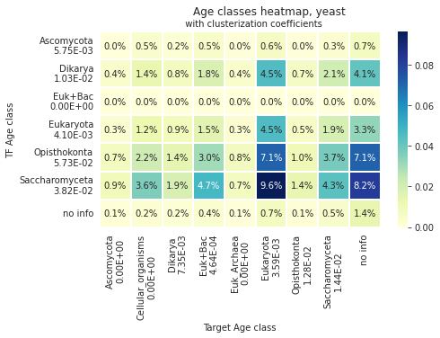
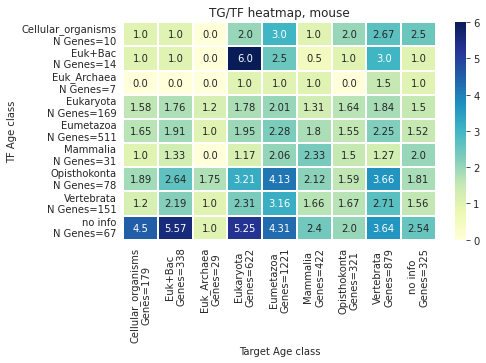
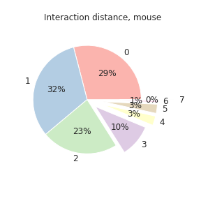
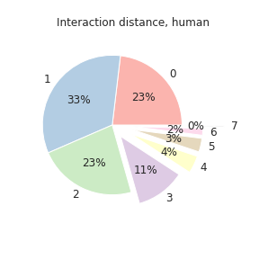
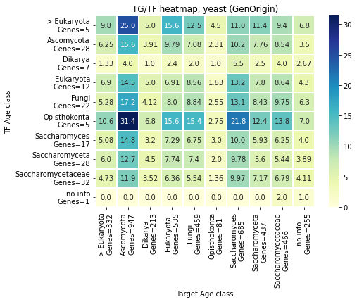
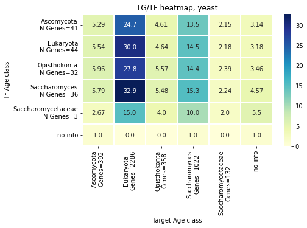

# Age in gene regulatory networks

Autors:
- **Yuliya Burankova**
- **Erik Zhivkoplias**, SciLifeLab, Stockholm University

---

For protein-protein interaction (PPI) networks in yeast and human, it was shown that proteins of the same age tend to interact more [1].

The **goal** of this project is to explore if gene interaction preference for genes with similar age holds in gene regulatory networks (GRNs), in particular in those that describe direct regulatory interaction (transcription factor-target gene).

Existing network prediction methods rely primarily on expression data. If it is possible to calculate how genes of different ages interact with each other, this will help create new, more plausible interactions of genes in GRNs.

GRNs are composed of: 
- nodes are the genes and their regulators
- edges are the regulatory relationships between the nodes
It is usually represented mathematically as an oriented graph. GRNs models regulatory interactions (indirect, not physical!).

# 1. Data:

Data (adjacency lists)
- Yeast GRN — full transcriptional regulatory network (Tnet) [2, 3].
- Mouse GRN — manually curated database (TRRUST v2) [4].
- Human GRN — manually curated database (TRRUST v2) [4].

Data contain the list of links between transcription factors (TF) and corresponding target genes (TG). All edges have been experimentally confirmed earlier.

The GRNs we know are the result of a long biological evolution. By contrast with other networks in biological systems, GRNs are harder to validate as the interactions that occur between molecules usually involve the indirect regulatory interaction through the biological molecules that are hard to detect and quantify. 

## 1.1. GRNs structure

*Code are avalible in `code/01_NetworkX_igraph.ipynb` file.*  

Yeast GRN:
- Total genes number: 4 441.
- TF number is 157, Target number is 4 410.
- Interactions number: 12 873.
- Contains only transcription factors and their targets.
- Average number of interaction for nodes: 2.8987.

Mouse GRN:
- Total genes number: 2 456.
- TF number is 827, Target number is 2 092.
- Interactions number: 7 057.
- Contains transcription factors, their targets and mode of regulation.
- Average number of interaction for nodes: 2.6425.

Human GRN:
- Total genes number: 2 862.
- TF number is 795, Target number is 2 492.
- Interactions number: 8 427.
- Contains transcription factors, their targets and mode of regulation.
- Average number of interaction for nodes: 2.9444.

# 2. Protein into gene age classes

*Code are avalible in `code/02_Liebeskind_age_classes.ipynb` file.*  

Protein age classes [5] (downloaded from [github](https://github.com/marcottelab/Gene-Ages/tree/master/Main)) were translated into gene age classes using protein-gene name matching from [YeastGenome](http://YeastGenome.org) and [UNIPROT](https://www.uniprot.org/help/uniprotkb) databases. 

Files with protein age classes are in `data/02_protein_ages`.

**Yeast**: age classes are available for 5 000 proteins.  
After mapping:  


**Mouse**: age classes are available for 19 950 proteins.  
After mapping:  


**Human**: age classes are available for 20 331 proteins.  
After mapping:  


#### 2.1. Heatmaps

Interaction maps of TFs and targets were built for each class (results on heatmap). The percentage of each type of links among all links is marked.

Results for Yeast GRN:  
 

Results for Mouse GRN:  


Results for Human GRN:  


The TG/TF heatmaps for each age class shows the number of genes in this class. At the intersection, the ratio of targets to transcription factors for edges of intersected ages classes was noted.

Results for Yeast GRN:  
  

Results for Mouse GRN:  
  

Results for Human GRN:  
 

#### 2.2. Interaction distances

The “difference” of ages in relationships was calculated. In the pie charts, the number is the difference between the ages, the smaller, the closer the ages of the interacting genes.

Results for Yeast GRN:  
  

Results for Mouse GRN:  
  

Results for Human GRN:  
  

Human and mouse GRNs have demonstrated a tendency for genes from similar age groups to interact more with each other than with more “distant” age groups. For the yeast network, this does not seem to be the case.

#### 2.3. Node degrees

The node degree is the number of edges adjacent to the node (indegree+outdegree). 

Results for Yeast GRN:  


Results for Mouse GRN:   


Results for Human GRN:  


For yeast GRNs, evolutionarily younger nodes have more edgesthan older ones  in the network. For mouse and human GRNs, the differences are less noticeable, there is no such drop in the number of connections with increasing age.


# 3. GenOrigin age classes

*Code are avalible in `code/03_GenOrigin_age_classes.ipynb` file.*  

The gene ages calculated from the protein ages gave different results for human and mouse and yeast GRNs. 

We decided to use the gene ages from the [GenOrigin](http://genorigin.chenzxlab.cn/#!/) [6] database for Yeast GRN parameters calculation (in `data/03_GenOrigin/Saccharomyces_cerevisiae.csv`).

Yeast: age classes are available for 6 600 genes.  
After mapping:  


We used the GenOrigin phylogenetic tree to convert a numerical age into an age class.

#### 3.1. Results for Yeast GRN (GenOrigin)

Label "> Eukaryota" means "older than Eukaryota" (gene age is more than 2101 million years). The same plots were created:


  

TF of 'Dikarya' age class control less targets than other TF classes, there are less than 6 targets per 'Dikarya' TF. Also, targets of 'Dikarya' and 'Opisthokonta' classes are controlled by more number of TF than other target classes. There are less than 5 'Opisthokonta' targets per TF. 

For these classes (TF of 'Dikarya' and targets of 'Opisthokonta'), the proportion of links among all links in the network is minimal for any type of edges (less than 0.3% for any combination).

  

Using gene ages from the GenOrigin, it seen that in the yeast network there is no significant predominance of interactions between similar age classes. Edges with age distances 0 ("same age") and 1 ("close age") account for less than 35% of all edges.

# 4. Phylostratigraphy

We used a phylostratigraphy approach [7] to determine the yeast genes age in GRN.

BLASTx:
- iTOL tree 8 (leave only Eukaryotes, for truncate the swiss db);
- truncated Swiss-prot database (94 268 sequences);
- e-value 10-3.

#### 4.1. Prepare swiss DB:
```
# index big fasta DB 
! makeblastdb -in ../data/04_blast_db/swiss/data  -dbtype prot -parse_seqids -blastdb_version 5 

# extract
! blastdbcmd -db ../data/04_blast_db/swiss/data -dbtype prot -entry_batch concatenated.txt -out ./data/04_blast_db/reduced_swiss/swiss_red.fa

# prepare new db
! cd ../red_db/

# delete duplicate in swiss dp
! seqkit rmdup 04_blast_db/red_swiss/swiss_red.fa > 04_blast_db/red_swiss/swiss_red_uniq.fa
! makeblastdb -in swiss_red_uniq.fa -dbtype prot -parse_seqids  -blastdb_version 5
```

The database class structure:


#### 4.2. BLAST
```
# run on swiss db
! blastx -db blast_db/red_swiss/swiss_red_uniq.fa -query ./genes_lists/S_cerevisiae_genes_seq.fa -num_threads 2 -evalue 1e-3 -out ./04_blast_results/blast_swiss_local.table -outfmt "6 qseqid sseqid stitle pident evalue bitscore"
```
#### 4.3. Results

  
 

The heatmap on the left shows the ratio of the number of targets to the TF for each age classes combination in the yeast GRN. Despite the fact that in our truncated swiss database the 'Opisthokonta' class was sufficiently represented, the targets of this age class turned out to be less than expected.

  

In this case, the fraction of "same age" interactions (0 distance) has increased. But the reason for this may be that we used a truncated tree (all age classes older than eukaryotes also received the label eukaryotes).

# Conclusion

In human GRN more than 56% and in mouse GRN 62% of nodes were "same" and "close" ages based on the use of protein ages. However, none of the three methods we used to obtain gene ages for the yeast network showed more than a 33-45% of nodes were "same" and "close" ages.

If gene interaction preference for genes with similar age holds in gene regulatory networks, incorporating biological knowledge into network inference methods could help to improve the reliability of the GRNs inferred from expression data.

Preliminary analysis shows a more complex age structure of the yeast gene regulatory network than in mice or human GRNs. 

We plan to blast GRNs genes to a fine-grained tree with more uniform representation of nodes across gene classes.


# Install and run code

## with pip

```console
git clone https://github.com/Freddsle/age_patterns
cd ./age_patterns/

# Create and activate your virtual environment

# create virtual environment
python3.10 -m venv ./venv

# activate virtual environment
source ./venv/bin/activate

# required by pip to build wheels
pip install wheel==0.37.0 

# Install requirements
pip install -r ./requirements.txt

# unzip files in swiss `data/04_blast_db/swiss`.

# for run .ipynb files
jupyter notebook
```

## with poetry

```console
# install poetry
# for details look for https://python-poetry.org/docs/
sudo apt-get install curl
curl -sSL https://raw.githubusercontent.com/python-poetry/poetry/master/get-poetry.py | python3 -

# poetry will be accessible in current session
source $HOME/.poetry/env

# prepare project
git clone https://github.com/Freddsle/age_patterns
cd ./age_patterns

# create env
poetry env use python3.10
poetry install

# unzip files in swiss `data/04_blast_db/swiss`.

# for run .ipynb files
poetry run jupyter notebook
```

## Used 
Python and libraries:
- **Python** 3.10.1
- NetworkX 2.8.1
- pandas 1.4.2
- Matplotlib 3.5.2
- NumPy 1.22.3
- Biopython 1.79
- seaborn 0.11.2
- ete3  3.1.2
- requests  2.27.1
- BeautifulSoup  4.11.1

BLAST:
- ncbi-blast-2.13.0+

# References

1. Chen, C-Y., et al. "Dissecting the human protein-protein interaction network via phylogenetic decomposition." Scientific reports 4.1 (2014): 1-10. [DOI](https://doi.org/10.1038/srep07153).  
2. Balaji, S., et al. "Comprehensive analysis of combinatorial regulation using the transcriptional regulatory network of yeast." Journal of molecular biology 360.1 (2006): 213-227. [DOI](https://doi.org/10.1016/j.jmb.2006.04.029).  
3. Vavulov, O., Zhivkoplias, E. "Building gene regulatory networks with structural properties." Bioinformatic institute (2021). [LINK](https://docs.google.com/presentation/d/1ZBNhW9yJzk3oTo-tg-uo0HHXHVlVUuEc/edit#slide=id.p1).  
4. Han, H., et al. "TRRUST v2: an expanded reference database of human and mouse transcriptional regulatory interactions." Nucleic acids research 46.D1 (2018): D380-D386. [DOI](https://doi.org/10.1093/nar/gkx1013).  
5. Liebeskind, B.J., McWhite, C.D., and Marcotte, E.M.. "Towards consensus gene ages." Genome biology and evolution 8.6 (2016): 1812-1823. [DOI](https://doi.org/10.1093/gbe/evw113).  
6. Tong, Y.-B., et al. "GenOrigin: A comprehensive protein-coding gene origination database on the evolutionary timescale of life." Journal of Genetics and Genomics (2021). [DOI](https://doi.org/10.1016/j.jgg.2021.03.018).  
7. Domazet-Lošo, T., Brajković J., and Diethard Tautz. "A phylostratigraphy approach to uncover the genomic history of major adaptations in metazoan lineages." Trends in Genetics 23.11 (2007): 533-539. [DOI](https://doi.org/10.1016/j.tig.2007.08.014). 
8. [iTOL tree](https://itol.embl.de/itol.cgi). 
